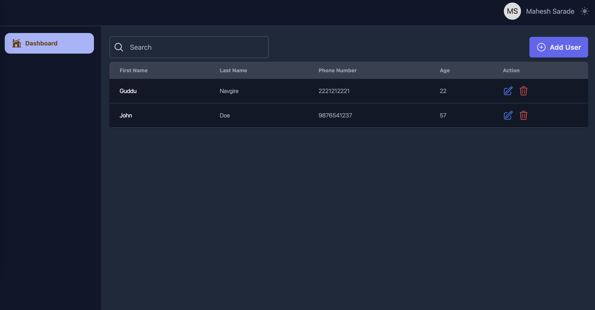
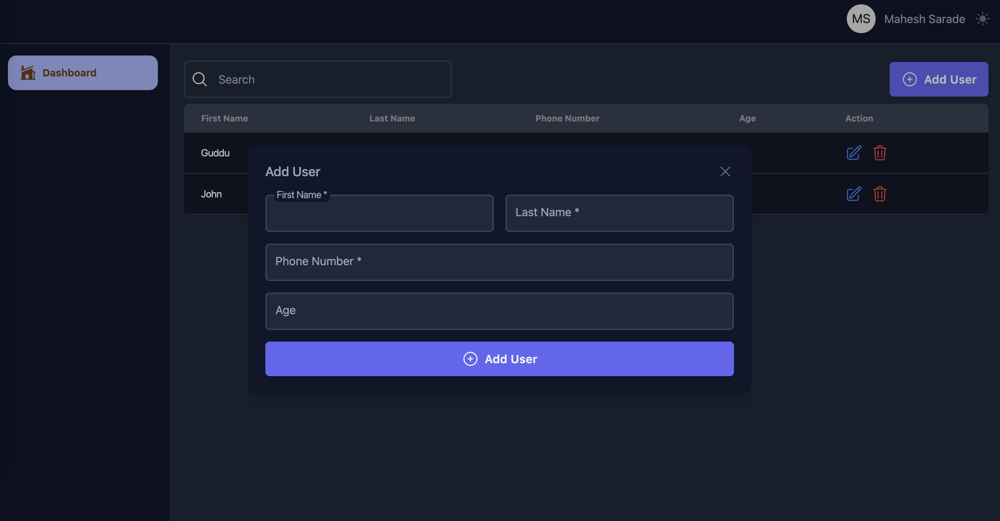

# Admin Portal

## Features

1. Admin portal with all CRUD functionality.
2. All input fields are validated with proper error message.
3. Dark-Light theme.
4. Admin can search user.
5. Responsive design.

run `npm install` to install the dependencies and run the project `npm start`
